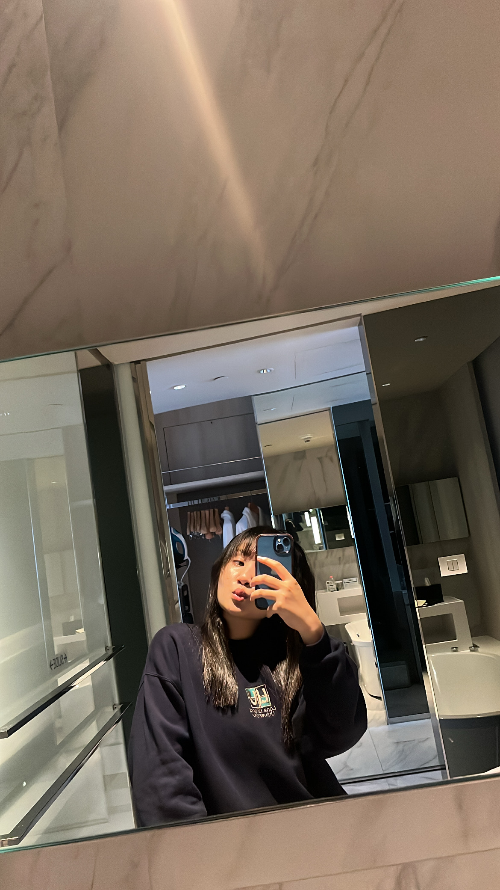

# ✨ **Welcome to [aomknw.github.io](https://aomknw.github.io)** ✨

---

## 🌟 **Project Overview**  
- **Kanokwan**  
  - **Aom**  

---

## 📸 **Project Snapshot** 📸

---

## 📚 **Navigation** 📚

| **Section**           | **Description**              | **Link**                              |
|-----------------------|-----------------------------|--------------------------------------|
| 🔐 **Authentication**  | Authentication Page         | [Authentication](https://aomknw.github.io/authentication)     |
| 🍪 **Cookie**          | Cookie Management Page      | [Cookie](https://aomknw.github.io/cookie)                  |
| 🎄 **Holiday E-Card**  | Christmas & New Year 2025   | [Merry Christmas & Happy New Year 2025](https://aomknw.github.io/e-card) |
| 🔐 **Data Quality**    | Data Completeness           | [Data Completeness](https://aomknw.github.io/completeness) |
| 🎮 **Boardgame**       | NCSA's Boardgame            | [NCSA's Boardgame](https://aomknw.github.io/boardgame) |
| 🔒 **Security Control**| Security Control Overview   | [Security Control](https://aomknw.github.io/security-control) |
| 🗳️ **PAO Elections**   | Chonburi PAO Elections 2025 | [PAO Elections](https://aomknw.github.io/pao-elections) |

---

### 🎁 **Thank you for visiting!**
