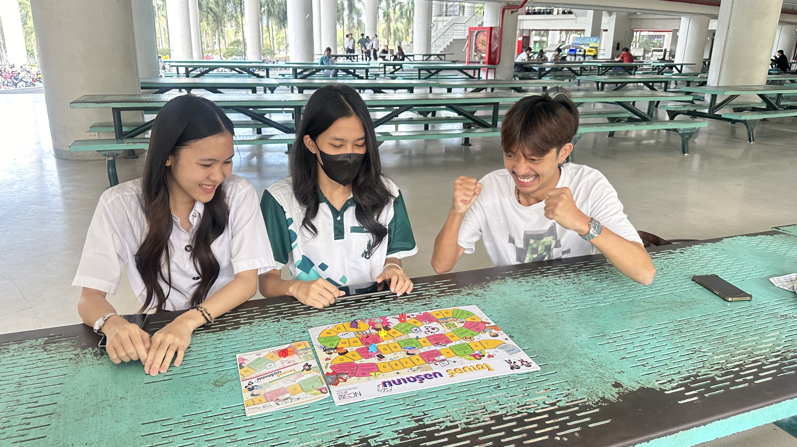
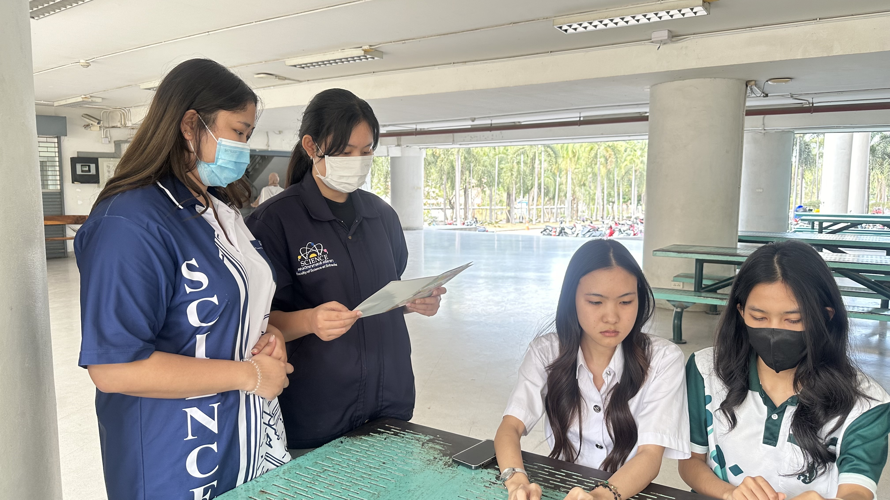
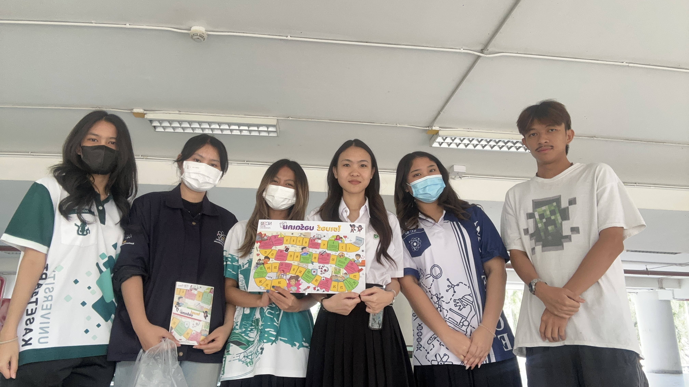

# 🔐 Securing the Human

---

# 🌷 Group: csg

เมื่อวันที่ 20 มกราคม 2568 ที่ผ่านมา กลุ่มนิสิตจากสาขาวิชาวิทยาการคอมพิวเตอร์ ภาคพิเศษ หรือ "csg" แห่งมหาวิทยาลัยเกษตรศาสตร์ วิทยาเขตศรีราชา ได้จัดกิจกรรมสุดสร้างสรรค์เพื่อส่งเสริมความรู้ความเข้าใจด้านความมั่นคงปลอดภัยไซเบอร์ให้กับนิสิตจากคณะวิศวกรรมศาสตร์ มหาวิทยาลัยบูรพา

กิจกรรมนี้จัดขึ้น ณ ใต้ตึก 17 โดยมีการนำบอร์ดเกมที่พัฒนาโดยสำนักงานคณะกรรมการการรักษาความมั่นคงปลอดภัยไซเบอร์แห่งชาติ (สกมช.) มาใช้เป็นสื่อกลางในการเรียนรู้ ซึ่งได้รับการตอบรับเป็นอย่างดีจากผู้เข้าร่วมกิจกรรมทั้ง 6 คน ที่ประกอบไปด้วยนิสิตจากมหาวิทยาลัยบูรพา 1 คน และตัวแทนสมาชิกจากกลุ่มผู้จัดทำอีก 5 คน

ตลอดระยะเวลาของกิจกรรม ผู้เข้าร่วมได้สนุกสนานไปกับการเล่นบอร์ดเกม พร้อมทั้งแลกเปลี่ยนความคิดเห็นเกี่ยวกับประเด็นสำคัญด้านความมั่นคงปลอดภัยไซเบอร์ เช่น หลักปฏิบัติตามมาตรฐานต่างๆ เพื่อให้ทุกคนตระหนักถึงภัยคุกคามที่อาจเกิดขึ้นในโลกออนไลน์ และสามารถป้องกันตนเองได้อย่างมีประสิทธิภาพ

บรรยากาศของกิจกรรมเต็มไปด้วยความเป็นกันเองและความสนุกสนาน แต่ในขณะเดียวกันก็แฝงไปด้วยสาระความรู้ที่มีคุณค่า ซึ่งสอดคล้องกับวัตถุประสงค์ของกิจกรรมที่ต้องการปลูกฝังให้เยาวชนตระหนักถึงความสำคัญของการรักษาความปลอดภัยในโลกไซเบอร์

กิจกรรมในครั้งนี้ถือเป็นตัวอย่างที่ดีของการนำเกมมาประยุกต์ใช้เพื่อสร้างสรรค์สังคม โดยเฉพาะอย่างยิ่งในยุคดิจิทัลที่ภัยคุกคามทางไซเบอร์เป็นเรื่องใกล้ตัวของทุกคน การเรียนรู้ผ่านกิจกรรมที่สนุกสนานจะช่วยให้ผู้คนจดจำและนำความรู้ไปปรับใช้ในชีวิตประจำวันได้ง่ายยิ่งขึ้น

กลุ่ม csg หวังว่ากิจกรรมในครั้งนี้จะเป็นจุดเริ่มต้นที่ดีในการสร้างเครือข่ายผู้ที่สนใจด้านความมั่นคงปลอดภัยไซเบอร์ และจะยังคงมีกิจกรรมดีๆ แบบนี้ออกมาให้ทุกคนได้ร่วมสนุกกันอย่างต่อเนื่อง

Click ที่ภาพเพื่อดูบรรยากาศการจัดกิจกรรม

# 🙋🏻‍♀️ Team Members

1. [Nisita Panichwaisawan]()
2. [Pariyakorn Kullama]()
3. [Kanokwan Riamsri](https://aomknw.github.io/boardgame)
4. [Chitlada Prasroetsang]()
5. [Panissara Boonparkorb]()
